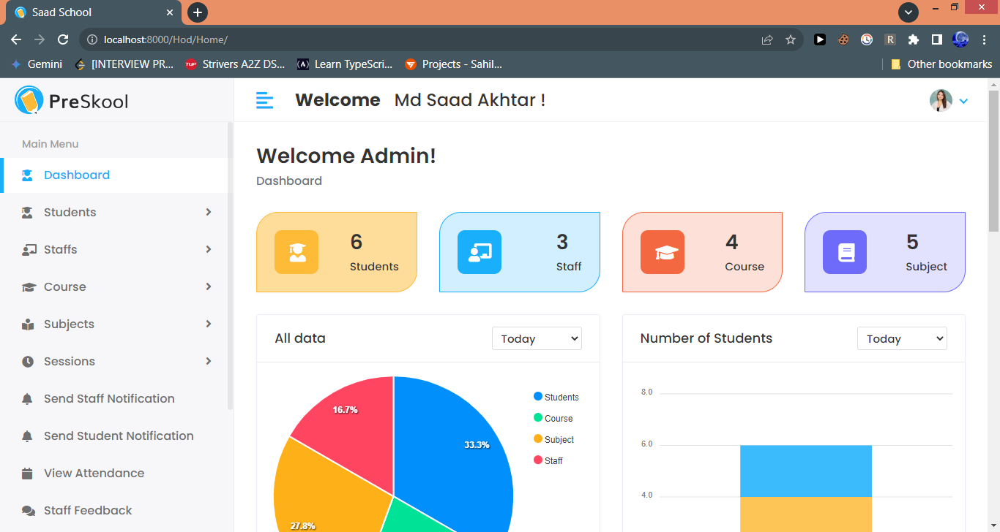

## School Management System


**A comprehensive web application for managing educational institutions.**

**Description**

This School Management System provides a user-friendly and efficient platform for schools to streamline administrative tasks, improve communication, and enhance the learning experience. It offers a modular structure with dedicated functionalities for various user roles.

**Features**

* **User Management:**
    * Secure login system with different roles (admin, staff, student).
    * Individual profiles for staff and students with relevant information.
* **Course Management:**
    * Create, edit, and view courses with details, schedules, and learning materials.
    * Assign courses to staff and students.
* **Session Management:**
    * Manage academic sessions (terms, semesters, etc.).
    * Track student progress and performance within each session.
* **Subject Management:**
    * Create, edit, and view subjects associated with courses.
* **Staff Management:**
    * Manage staff profiles, roles, leaves, and notifications.
    * Track attendance and workload.
    * Optionally, staff can:
        * Take attendance.
        * Apply for leave.
        * Submit feedback.
        * View attendance reports.
* **Student Management:**
    * Manage student profiles, attendance, and performance records.
    * Optionally, students can:
        * Apply for leave.
        * Submit feedback.
        * View attendance and results.
* **Communication Tools:**
    * Secure messaging system for staff, students, and administration.
    * System-wide announcements and notifications.


### A. Admin Users Can :
1. See Overall Summary Charts of Students Performances, Staff Performances, Courses, Subjects, Leave, etc.
2. Manage Staff (Create, Read, Update and Delete)
3. Manage Students (Create, Read, Update and Delete)
4. Manage Course (Create, Read, Update and Delete)
5. Manage Subjects (Create, Read, Update and Delete)
6. Manage Sessions (Create, Read, Update and Delete)
7. View Student Attendance
8. Review and Reply Student/Staff Feedback
9. Review, Approve or Reject Student/Staff Leave
10. Send Notifications to Student/Staff

### B. Staff/Teachers Can :
1. See the Overall Summary Charts related to their students, their subjects, leave status, etc.
2. Take/Update Students Attendance
3. Add/Update Result
4. Apply for Leave
5. Send Feedback to HOD
6. View Notifications

### C. Students Can :
1. See the Overall Summary Charts related to their attendance, their subjects, leave status, etc.
2. View Attendance
3. View Result
4. Apply for Leave
5. Send Feedback to HOD
6. View Notifications

## Screenshots




**Project Structure**

The project follows a clear directory structure for better organization:

* **base.html:** The base template for all application pages.
* **includes:** Reusable components like header, footer, sidebar, message display, and charts .
* **login.html:** Login page for user authentication.
* **profile.html:** User profile page for managing personal information.
* **staff:** Contains staff-specific functionalities.
    * **add_result.html:** Add student results .
    * **apply_leave.html:** Apply for leave.
    * **feedback.html:** Submit feedback.
    * **home.html:** Staff dashboard.
    * **notifications.html:** View notifications.
    * **take_attendance.html:** Take student attendance .
    * **view_attendance.html:** View attendance reports .
* **student:** Contains student-specific functionalities.
    * **apply_leave.html:** Apply for leave.
    * **feedback.html:** Submit feedback.
    * **home.html:** Student dashboard.
    * **notifications.html:** View notifications.
    * **view_attendance.html:** View attendance records.
    * **view_result.html:** View academic results .
* **hod:** Contains functionalities for Head of Department (or similar role).
    * **add_course.html:** Create new courses.
    * **add_session.html:** Create new sessions .
    * **add_staff.html:** Add new staff members.
    * **add_student.html:** Add new students.
    * **add_subject.html:** Add new subjects.
    * **edit_course.html:** Edit existing courses.
    * **edit_session.html:** Edit existing sessions .
    * **edit_staff.html:** Edit staff profiles.
    * **edit_student.html:** Edit student profiles.
    * **edit_subject.html:** Edit subject details.
    * **home.html:** HOD dashboard.
    * **staff_feedback.html:** View staff feedback.
    * **staff_leave.html:** Manage staff leave requests.
    * **staff_notification.html:** Send notifications to staff.
    * **student_feedback.html:** View student feedback.
    * **student_leave.html:** Manage student leave requests.
    * **student_notifications.html:** Send notifications to students.
    * **view_attendance.html:** View attendance reports .
    * **view_course.html:** View course details.
    * **view_session.html:** View session details .
    * **view_staff.html:** View staff profiles.
    * **view_student.html:** View student profiles.
    * **view_subject.html:** View subject details.

**Technology Stack**
* Programming Language(s): (e.g., Python)
* Web Framework : (e.g., Django, Spring, Laravel)
* Database System: (e.g., MySQL, PostgreSQL)
* Front-End Technologies : (e.g., HTML, CSS, JavaScript)

**Getting Started**

### Pre-Requisites:
1. Install Git Version Control
[ https://git-scm.com/ ]

2. Install Python Latest Version
[ https://www.python.org/downloads/ ]

3. Install Pip (Package Manager)
[ https://pip.pypa.io/en/stable/installing/ ]
### Installation
**1. Create a Folder where you want to save the project**

**2. Create a Virtual Environment and Activate**

Install Virtual Environment First
```
$  pip install virtualenv
```

Create Virtual Environment

For Windows
```
$  python -m venv venv
```
For Mac
```
$  python3 -m venv venv
```
For Linux
```
$  virtualenv .
```

Activate Virtual Environment

For Windows
```
$  source venv/scripts/activate
```

For Mac
```
$  source venv/bin/activate
```

For Linux
```
$  source bin/activate
```

**3. Clone this project**
```
$  git clone https://github.com/akhtarmdsaad/School_management_system.git
```

Then, Enter the project
```
$  cd student-management-using-django
```

**4. Install Requirements from 'requirements.txt'**
```python
$  pip3 install -r requirements.txt
```

**5. Add the hosts**

- Go to settings.py file 
- Then, On allowed hosts, Use **[]** as your host. 
```python
ALLOWED_HOSTS = []
```
*Do not use the fault allowed settings in this repo. It has security risk!*

**6. Make necessary Tables in Data**  
- Go to the terminal  
- Run the command

Command for Windows:
```python
$ python manage.py makemigrations
$ python manage.py migrate
```

Command for Mac:
```python
$ python3 manage.py makemigrations
$ python3 manage.py migrate
```

Command for Linux:
```python
$ python3 manage.py makemigrations
$ python3 manage.py migrate
```


**7. Login Credentials**

Create Super User (HOD)
Command for PC:
```
$  python manage.py createsuperuser
```

Command for Mac:
```
$  python3 manage.py createsuperuser
```

Command for Linux:
```
$  python3 manage.py createsuperuser
```


**8. Now Run Server**

Command for Windows:
```python
$ python manage.py runserver
```

Command for Mac:
```python
$ python3 manage.py runserver
```

Command for Linux:
```python
$ python3 manage.py runserver
```

Then provide the required inputs to create superuser.

**Additional Notes**

* This README provides a high-level overview of the system's functionalities and structure. 
* Feel free to explore the codebase, tailor the system to your specific school's needs, and contribute to its development!

**Security Considerations**

* User authentication and authorization with strong password hashing techniques, to safeguard student and staff data.

**Future Enhancements Plans**

* **Mobile App Development:** Developing a mobile app for students, parents, and staff to access the School Management System on the go.
* **Integration with External Services:** Integrating with third-party services like online payment gateways, learning management systems, or video conferencing tools for enhanced functionality.
* **Advanced Reporting and Analytics:** Implementing more sophisticated reporting capabilities to provide deeper insights into student performance and school operations.

**Contributing**

If you're interested in contributing to the School Management System project, you can:

* **Fork the Repository:** Fork the project repository on GitHub to create your own copy and make changes.
* **Create Pull Requests:** Create pull requests on GitHub to propose your modifications to the main project codebase.
* **Report Issues:** If you encounter any bugs or issues, report them through the GitHub issue tracker.

**By working together, we can create a comprehensive and user-friendly School Management System that empowers schools to improve efficiency and enhance the learning experience for students and staff.**
